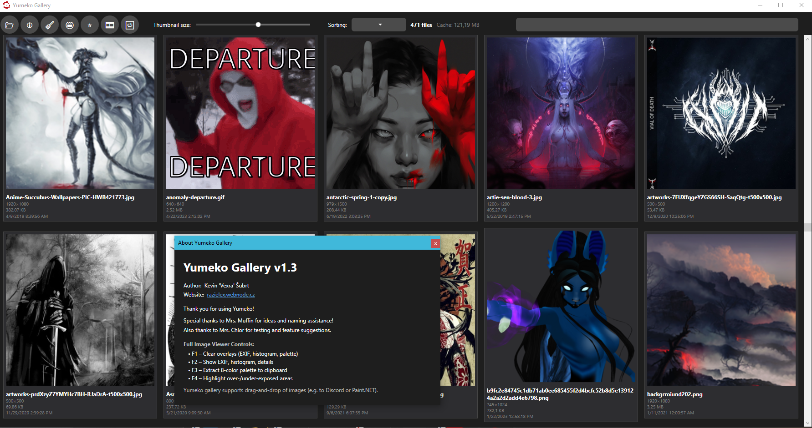

# Yumeko Gallery

Yumeko Gallery is a modern, lightweight, and powerful media manager for Windows, written in C# (.NET 7/WPF). It makes browsing and organizing all your images and videos in your chosen folders a breeze.
It functions both as an Image Viewer and a Video Player.

Key Features
Multi‑Folder Loading with “remember last used” paths

Dynamic Thumbnails supporting GIF, WebP, JFIF, and more

Drag & Drop: simply drag an image or video from the gallery into another app (Discord, Paint.NET, Explorer…)

Full‑Screen Image Viewer

Smooth zoom & pan with mouse

F1: hide overlays (EXIF, histogram, palette…)

F2: show EXIF, histogram, image details

F3: extract an 8‑color palette and copy HEX codes to clipboard

F4: heatmap overlay for over‑/under‑exposed areas

Built‑in Video Player

Hardware‑accelerated decoding for smooth playback

Pillar‑boxing support to avoid unwanted borders

Click‑to‑pause/play anywhere on the video

Keyboard shortcuts:

Space = play/pause

Left/Right arrows = seek ±5 seconds

Esc or double‑click = exit full‑screen

Replay and Loop buttons

Load external subtitles (SRT) on the fly

Audio track switching for multi‑track videos

Auto‑hide UI and mouse cursor after 5 seconds of inactivity

Duplicate Finder: locate, preview, and delete repeat files easily

On‑Disk Thumbnail Cache for faster relaunch and reduced RAM usage

Sort & Filter by name, date, size, and resolution

EXIF Overlay displays basic metadata directly in the viewer

Installation
Download the Yumeko Installer (choose the build with or without .NET included)

(Optional) Install the .NET 7 Desktop Runtime if you don’t already have it

© 2025 Kevin “Vexra” Šubrt – razielex.webnode.cz

Thanks to all our testers for your ideas and support—especially Mrs. Muffin and Mrs. Chlor!
